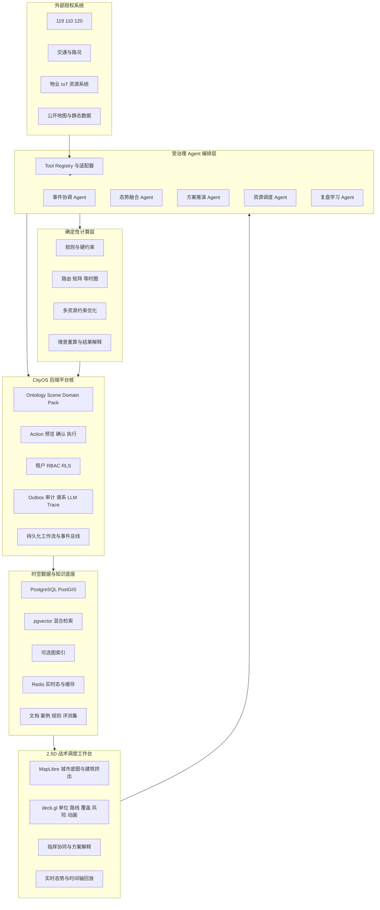

# CityOS 最终版技术架构调研

> 日期：2026-08-24
> 用途：统一最终成品的技术架构、研发边界与技术问答口径。全文按完整系统交付后的能力与工程实现进行表达。

## 一、结论

CityOS 最终版应被定义为一套面向城市安全事件的**时空智能决策与协同执行平台**，而不是地图大屏、聊天机器人或单点路径算法。

最终系统由六个相互约束的核心组成：

1. **城市安全 Domain Pack**：统一事件、建筑、道路、资源、任务、反馈和复盘知识的对象模型。
2. **适配型 Agent 架构**：通过标准工具和数据适配器接入授权的 119、110、120、交通、物业、IoT 和资源系统。
3. **确定性推演与优化引擎**：规则、路由、约束求解和多资源优化负责“算”；大模型负责归并、解释、提议和交互。
4. **受治理 Action 管道**：所有跨部门或高风险动作必须经过预览、权限校验、人工确认、执行、回执和审计。
5. **知识沉淀与受控自进化**：执行反馈进入案例库、规则候选和评测集，通过离线回放、人工审核、版本发布和回滚持续改进。
6. **2.5D 战术调度工作台**：用战术沙盘方式表达单位、路线、任务、覆盖、风险和时间演化，支持实时调度与历史回放。

最合理的工程路线是建设 CityOS 原生后端平台核，把通用对象、Action、权限、审计和领域能力分层实现，让城市安全领域包与战术调度体验共享同一套受治理的运行时。

## 二、最终总体架构



### 2.1 责任边界

| 层 | 负责 | 不负责 |
|---|---|---|
| Agent | 多源信息归并、缺口发现、工具选择、方案组织、解释与追问 | 直接修改业务系统、绕过权限、替代确定性计算 |
| 推演引擎 | 路由、约束、资源匹配、方案评分、条件重算 | 猜测缺失事实、生成未经标注的输入 |
| Action 管道 | 预览、确认、幂等执行、回执、审计、补偿 | 让前端或 LLM 直接写业务表 |
| 知识系统 | 来源化检索、案例记忆、规则版本、评测集、反馈学习 | 未经审核自动发布高风险规则 |
| 2.5D 工作台 | 呈现空间关系、单位状态、方案差异和时间演化 | 用视觉效果替代真实计算和数据来源 |

这种分工与 MCP 的工具模型一致：工具应有明确输入/输出 Schema，敏感调用需要人工确认、访问控制、超时和审计；资源则用于向 Agent 提供可追溯上下文。[MCP Tools](https://modelcontextprotocol.io/specification/2025-11-25/server/tools) [MCP Resources](https://modelcontextprotocol.io/specification/2025-11-25/server/resources)

## 三、适配型 Agent 架构

### 3.1 Agent 角色

| Agent | 输入 | 输出 | 关键限制 |
|---|---|---|---|
| 事件协调 Agent | 标准事件、任务状态、人工指令 | 选择下一阶段、协调其他 Agent | 不直接执行高风险动作 |
| 态势融合 Agent | 警单、上报、IoT、建筑、历史案例 | 已确认事实、待核实项、冲突和缺口 | 保留来源与置信度，不替用户裁决冲突 |
| 方案推演 Agent | 事件状态、规则、路网、资源、知识 | 候选方案与需要调用的计算工具 | 数值必须来自确定性引擎 |
| 资源调度 Agent | 资源能力、位置、任务、路线矩阵 | 多资源编组、路线和时间窗 | 不把“最近”误当“最合适” |
| 执行监控 Agent | 签收、在途、到场、异常、撤销 | 偏差识别、补充方案和升级建议 | 失败重试必须幂等，副作用必须可审计 |
| 复盘学习 Agent | 全链路日志、实际结果、人工评价 | 案例、规则候选、评测样本 | 只能提交候选，不能自行发布生产规则 |

### 3.2 适配层

每个外部系统通过统一 Adapter Contract 接入：

```text
外部消息 / API
  → 身份与权限校验
  → 字段映射和版本校验
  → 去重、时钟和顺序处理
  → Canonical Event / Resource / Feedback
  → 来源、时间、置信度、适用范围
  → 事件总线与 Agent Tool Registry
```

适配器应同时支持 REST/OpenAPI、Webhook、消息队列、文件批次和 MCP-compatible Tool/Resource。MCP 适合统一 Agent 的工具发现和 Schema，但不能替代业务权限、幂等键、审计和人工确认。HTTP 接入需要资源绑定的 OAuth 权限控制，不能把上游令牌无约束传给下游工具。[MCP Authorization](https://modelcontextprotocol.io/specification/2025-11-25/basic/authorization)

### 3.3 持久化与恢复

最终系统将两类状态分开：

- **Agent 会话状态**：由 LangGraph Checkpointer 保存单次事件的图状态，Store 保存跨事件事实和共享知识。官方文档明确区分线程内检查点和跨线程长期存储。[LangGraph Persistence](https://docs.langchain.com/oss/python/langgraph/persistence)
- **业务长流程状态**：由持久化工作流引擎维护事件历史、等待人工确认、超时、重试和补偿。Temporal 的工作流通过事件历史恢复故障前状态，外部 API、数据库和 LLM 调用放在 Activity 中。[Temporal Workflows](https://docs.temporal.io/workflows)

两者不能混成一个“万能 Agent 内存”：Agent 状态用于思考连续性，业务工作流用于可靠执行和责任追踪。

## 四、推演与资源优化引擎

### 4.1 三层计算

1. **路径层**：Valhalla 提供路线、时间距离矩阵和等时圈；PostGIS/pgRouting承担空间查询、覆盖与批量网络分析；本地 Dijkstra/A*保留为离线和故障降级。
2. **约束层**：把道路封闭、车辆能力、资源可用性、时间窗、辖区覆盖、跨部门权限等转成显式硬约束和软约束。
3. **优化层**：OR-Tools 解决车辆、人员、装备和任务的组合分配，输出可行或近优方案，并设置求解时限，避免大规模问题无限搜索。

Valhalla 原生提供路线、矩阵和等时圈服务，适合作为可替换的 Route Provider。[Valhalla Route](https://valhalla.github.io/valhalla/api/turn-by-turn/overview/) [Matrix](https://valhalla.github.io/valhalla/api/matrix/) [Isochrone](https://valhalla.github.io/valhalla/api/isochrone/)

OR-Tools 支持车辆容量、时间窗和资源限制，但大规模车辆路径问题可能只能在时限内返回近优解，因此输出必须同时包含求解状态、约束满足情况和超时降级说明。[OR-Tools Vehicle Routing](https://developers.google.com/optimization/routing)

### 4.2 方案输出合同

每个方案必须包含：

- 输入快照和数据版本；
- 必须满足的硬约束；
- 可权衡的软目标及权重；
- 资源编组与任务依赖；
- 路线、ETA 区间和覆盖变化；
- 风险、冲突、未知项和降级状态；
- 与其他方案的关键差异；
- 需要人工确认的 Action；
- 条件改变后的可重算标识。

这样展示的不是“AI 给了一个答案”，而是“系统在一组可追溯条件下生成了若干可执行方案”。

## 五、知识沉淀与受控自进化

### 5.1 知识对象

最终知识系统至少包含六类对象：

| 对象 | 内容 |
|---|---|
| Source | 法规、预案、接口文档、人工记录、公开资料及版本 |
| Case | 事件输入、方案、人工决策、执行过程和结果 |
| Rule | 适用条件、约束、版本、审批人、有效期和回滚点 |
| Skill | 可复用的 Agent 工具链和任务模板 |
| Evaluation | 黄金样本、对抗样本、回放场景和指标 |
| Feedback | 签收、到场、异常、人工评价和复盘结论 |

PostgreSQL 保存权威元数据、版本和权限；PostGIS保存空间对象；pgvector 与全文检索组成混合检索；图索引用于实体关系和影响链。pgvector 官方支持向量检索、HNSW/IVFFlat，以及与 PostgreSQL 全文搜索组合的混合检索。[pgvector](https://github.com/pgvector/pgvector)

### 5.2 自进化闭环

```text
事件与执行反馈
  → 来源化清洗与案例结构化
  → 发现重复模式、错误和知识缺口
  → 生成规则 / Prompt / Tool / 检索策略候选
  → 历史回放与离线评测
  → 人工审核与安全审批
  → 版本化发布和小流量验证
  → 在线监控
  → 保留、修订或回滚
```

“自进化”指系统能够持续形成新案例、更新检索索引、提出规则候选并用评测数据验证改进；不指模型能够自行扩大权限、修改硬约束或把未经审核的经验直接发布到生产。NIST AI RMF 强调明确人机责任、验证、文档化、监控和风险治理，这些应成为进化管道的硬门槛。[NIST AI RMF Core](https://airc.nist.gov/airmf-resources/airmf/5-sec-core/)

## 六、2.5D 战术调度工作台

### 6.1 技术方案

最终资源调度界面采用“战术沙盘”表达，而不是传统点位地图：

- MapLibre 负责底图、道路、建筑挤出、相机俯仰和空间选择；`fill-extrusion` 支持按要素高度和状态进行数据驱动的建筑挤出。[MapLibre Fill Extrusion](https://maplibre.org/maplibre-style-spec/layers/)
- deck.gl `IconLayer` 使用预打包 Sprite Atlas 渲染大量战术单位，适合消防车、救护车、警力、人员和设备状态。[IconLayer](https://deck.gl/docs/api-reference/layers/icon-layer)
- `TripsLayer` 渲染单位按时间戳运动的路线和轨迹，用于在途调度与回放。[TripsLayer](https://deck.gl/docs/api-reference/geo-layers/trips-layer)
- `PolygonLayer`、`ArcLayer`、`PathLayer` 表达覆盖区、风险区、跨部门调度关系和方案路线。
- 对少量高价值单位可选 `ScenegraphLayer` 加载 glTF 低模；大规模单位仍优先用 Sprite，避免视觉资产拖垮性能。[ScenegraphLayer](https://deck.gl/docs/api-reference/mesh-layers/scenegraph-layer)

### 6.2 战术交互

最终工作台应具备：

- 固定俯视角与可控旋转，不做自由漫游式三维城市；
- 单位选择圈、状态条、任务箭头、编组和目标点；
- 资源覆盖圈、禁行区、风险区、协同走廊和冲突提示；
- 路线预览、时间窗、预计通过点和到场顺序；
- 地图上直接调整资源或条件，并立即触发后端重算；
- 实时态势和历史回放使用同一时间轴；
- 不确定信息通过形状、透明度和虚线表达，不能被游戏化效果掩盖。

### 6.3 性能架构

- 静态建筑、道路和大规模资产由 PostGIS 生成 MVT，按视野和缩放级别加载；`ST_AsMVT` 可以把带几何和属性的查询结果编码为矢量瓦片。[PostGIS ST_AsMVT](https://www.postgis.net/docs/ST_AsMVT.html)
- 实时单位不反复刷新整层 MVT，而通过 WebSocket 推送当前位置和状态增量。
- 前端按语义缩放做聚合和 LOD：低缩放显示编组，高缩放显示单车、人员和任务。
- 轨迹按时间分区、抽稀和按需回放；当前态放 Redis/PostgreSQL，历史点进入分区表。

## 七、CityOS 后端建设结论

实现基线：以 CityOS 机器可读接口合同、数据库迁移和当前版本验收证据为准。

### 7.1 可直接成为 CityOS 平台核的部分

| 后端平台能力 | CityOS 用法 |
|---|---|
| Ontology / Scene / Layer / Domain Pack | 建立消防、警务、医疗、交通和重大活动 Pack |
| YAML Object / Action / Tool Schema | 统一 Agent 工具、业务动作和数据合同 |
| FastAPI 通用 API 核 | 提供对象、场景、Action、Logic 和运维接口 |
| PostgreSQL + PostGIS + MVT | 作为时空真相源和地图服务 |
| Action preview/confirm/execute | 承接封路、派遣、通知和资源调整等高风险动作 |
| RBAC、RLS、多租户 | 隔离部门、区域、角色和敏感事件 |
| Outbox、Audit、Decision Lineage、LLM Trace | 记录动作、副作用、Agent 工具和模型调用 |
| `pack_mobility` | 复用移动单位、实时位置、轨迹、围栏和回放 |
| `pack_transport` | 复用道路、施工区、绕行和空间关联能力 |
| Process Event / Case Spine | 形成事件从受理到结束的统一时间线 |

仓库中已经存在 Action 调度、人工确认、租户权限、Outbox、LLM trace、WebSocket 实时场景、轨迹与回放等实现，并有 35 个 API 测试文件、171 个测试函数以及 Ontology Contract CI。Python 应用代码在本次审计中通过 `compileall`；本次未配置数据库执行完整集成测试，因此复用前仍需在统一环境跑全量测试。

### 7.2 需要 CityOS 新增或重构的部分

- 城市安全统一 Incident、Resource、Task、Feedback 和 Knowledge Pack；
- 事件协调与五类专业 Agent；
- 119/110/120/交通/物业/IoT 适配器；
- Valhalla、pgRouting、OR-Tools 的统一计算 Provider；
- CityOS 的 2.5D 战术调度工作台；
- 知识版本、评测集、规则候选、灰度发布和回滚；
- 面向应急场景的权限、脱敏、保留期和双人确认策略。

### 7.3 不建议直接搬用的部分

- 其他领域系统的领域表和业务规则；
- 与 CityOS 战术调度体验不一致的通用工作台 UI；
- 开发账号、固定密钥和演示配置；
- 把 Neo4j 作为所有城市关系的默认主库。PostgreSQL/PostGIS 仍应是权威真相源，图索引按具体查询价值启用。

### 7.4 复用前置条件

GitHub API 与克隆内容显示该公开仓库没有声明 LICENSE 文件或 SPDX License。即使属于同一组，合并前也应补齐代码归属、内部复用授权、第三方依赖清单和贡献记录。推荐把平台核抽成受版本管理的内部包或独立仓库，由 CityOS 依赖，不要长期复制粘贴形成两套分叉平台核。

## 八、实施顺序与验收

### 8.1 实施顺序

1. 建立 CityOS 原生平台核，冻结 Object/Action/Tool/Scene 契约。
2. 建立 CityOS Incident、Resource、Task、Feedback Pack 和适配器框架。
3. 接入持久化工作流、Agent 编排、权限和全链路审计。
4. 接入路由矩阵、约束引擎和资源优化器，形成多方案推演。
5. 建设案例库、混合检索、评测集和受控进化流水线。
6. 将 Mobility 实时态、轨迹和回放接入 2.5D 战术工作台。
7. 通过历史回放、故障注入、权限测试和性能压测完成最终验收。

### 8.2 必须验收的指标

| 类别 | 指标 |
|---|---|
| 适配 | 字段映射成功率、重复事件合并率、乱序/迟到处理、来源完整率 |
| Agent | 工具调用成功率、无依据结论率、上下文恢复率、人工打断后恢复率 |
| 推演 | 可行方案率、硬约束违反率、重算时延、求解状态与降级说明完整率 |
| 路由 | ETA 绝对误差、误差区间覆盖率、封路重算正确率、矩阵缓存命中率 |
| 执行 | 任务签收延迟、重复副作用为零、补偿成功率、审计链完整率 |
| 知识 | 检索命中率、引用正确率、规则候选通过率、回放改进率、回滚成功率 |
| 2.5D | 目标设备帧率、交互延迟、单位上限、实时更新延迟、长时间运行稳定性 |
| 安全 | 越权调用拦截率、双人确认覆盖率、敏感字段脱敏、租户隔离测试 |

## 九、最终版技术问答 Q9–Q14

> 问答口径：以现有页面能够展示的业务链路为基础，并按最终交付版本纳入三项已完成能力——正式后端与授权接口适配、经过真实数据校准的调度计算、可检索可评测的案例与知识资产。多 Agent、自主修改规则和红警式战术调度台不作为现有能力表述。

二、技术能力与工程实现类

Q9：请介绍你们系统中最核心、最难实现的技术模块，以及为什么具有挑战。

30 秒答法：

最核心、也最难的是从事件接入到方案推演、任务执行和知识沉淀的完整链路。系统要把授权接口进入的事件和资源状态、信息可信度、建筑与路网约束、路线和 ETA、资源比较、人工确认、任务下发、执行回传和历史案例串起来；任何条件改变后，方案指标、任务版本和批准状态都要同步变化，并且能解释数据来源和变化原因。

可展开补充：

技术上我们把数据接入、推演计算和 UI 状态分开。后端先把不同来源映射为统一的事件、资源、任务和回执对象，并保留来源、更新时间和可信度；调度计算使用经过历史与真实数据校准的路网、ETA 和资源规则，比较响应时间、覆盖风险和任务编成。前端再用 React、MapLibre 和 deck.gl 把建筑、资源、路径和动态状态叠加到同一空间界面。

现场可以直接修改投入规模或选择替代资源，系统会生成新的方案版本，使原人工批准失效，并重新形成任务包；收到签收超时、资源不可用等反馈时，又会触发异常提示、替代方案比较和受控重试。事件结束后，任务回传、偏差和报告会进入案例库，供后续检索和评测。因此难点不是做一张地图，而是保证数据、计算、决策、执行和复盘始终一致。

别踩坑：

不要把重点讲成多 Agent 或大模型。最有说服力的是现场操作一项条件，让评委看到方案、ETA、批准版本和任务状态一起变化，再展示这次执行如何沉淀为可追溯案例。

Q10：哪些能力是团队自主研发？哪些依赖第三方技术？

30 秒答法：

自主研发的是产品链路、城市安全对象模型、接口适配与数据归一、策略触发规则、路线和 ETA 校准、资源比较、人工批准、任务状态流、异常回传、案例知识库、评测口径和前端交互。第三方主要提供基础能力，包括 OSM 路网和 POI、OpenFreeMap 瓦片、React 工程框架，以及 MapLibre、deck.gl 的地图和空间渲染。

可展开补充：

我们没有声称自研地图引擎，也没有把开源底图包装成自有数据。我们的技术价值在于把不同接口的数据映射成统一事件，把路线、资源和规则组织成可比较方案，再把人工决策、任务反馈和历史案例连成一条可运行的处置链路。地图上的建筑立体化、动态路径和资源位置是空间表达；这些对象如何参与方案、触发状态变化并进入复盘，是团队定义的领域能力。

底层对象、权限、审计和实时状态由 CityOS 原生后端提供，城市安全领域模型、推演规则和产品闭环在同一版本体系内演进。对外应表述为“具备授权接口适配和统一接入能力”，不要未经具体项目授权就声称已经接入某地 119、110、120 的生产系统。

别踩坑：

不要把开源组件包装成自主研发，也不要把“具备接口适配能力”说成“已经获得某个政府系统的生产数据权限”。

Q11：如果用户规模扩大 100 倍，你们目前架构最大的挑战是什么？

30 秒答法：

扩大 100 倍后，最大的挑战是实时状态一致性和计算成本。大量事件同时进入时，路线矩阵、资源占用、方案版本、人工批准、任务回执、知识索引和权限隔离都要保持一致；任何一处延迟或重复消息，都可能让调度页面和实际任务状态不一致。

可展开补充：

架构上要把事件接入、资源状态、路线计算、方案生成、任务回执和知识处理拆成清晰边界，使用异步任务、缓存、幂等键和审计日志保证可恢复。路线与覆盖计算按事件范围、时间窗和路网版本缓存；静态建筑与实时资源分层更新；案例和规则评测进入独立队列，不能阻塞正在进行的处置。

别踩坑：

不要直接承诺“支持 100 倍”。应该说明事件并发量、资源更新频率、路线计算规模和知识索引规模，并以压测结果给出容量边界。

Q12：当前方案最大的技术风险是什么？如果继续投入，优先优化哪里？

30 秒答法：

最大的技术风险不是有没有接口，而是不同系统的数据质量、更新频率和业务口径不一致，错误或过期状态可能被带入调度结果。我们的控制方式是让所有事实带来源、更新时间和可信度，让路线与 ETA 给出校准范围，让高风险动作保留人工确认，并在接口异常时使用最后有效状态和降级规则。

可展开补充：

继续投入时，优先优化三件事：适配器的异常处理和数据质量监测；路线、ETA、资源覆盖和任务优先级的持续校准；案例库与规则库的评测机制。道路限高、限宽、限重以及建筑内部结构仍可能存在数据空缺，因此系统必须明确计算边界，不能把资源推演扩大解释为火势物理仿真。

别踩坑：

不要说“接了真实接口，数据就一定准确”，也不要把案例沉淀说成系统可以自动修改生产规则。数据治理、人工责任和规则审核仍然必须保留。

Q13：你们如何证明系统有效？有哪些指标可以验证？

30 秒答法：

我们从计算、流程和学习三层验证。计算层看路线和 ETA 误差、方案重算时延以及硬约束是否满足；流程层看态势补齐、人工确认、任务签收和异常回填时间；学习层看历史案例能否被准确检索，新规则在固定评测集上是否真正改善结果。

可展开补充：

现场最直接的验证仍然是改一个条件并当场重算：调整投入规模或替换资源后，ETA、覆盖风险和任务包版本同步更新，原批准失效；执行回传异常后，系统提示替代资源并重新进入确认流程。后台则持续记录接口完整率、数据延迟、ETA 误差、任务签收率、异常回填率、案例检索命中率和规则评测结果。

别踩坑：

不要只用“页面能重算”证明有效。重算证明系统不是静态页面，真实效果还要由校准误差、流程指标、历史回放和试点数据共同证明；也不要直接承诺减少伤亡。

Q14：如果获得更多技术资源，你认为最值得投入研发的方向是什么？

30 秒答法：

在真实接入、调度校准和知识资产已经完成的基础上，最值得继续投入三个方向：第一是增强多事件并发下的跨区域资源冲突推演；第二是把适配器和领域模型扩展到更多城市、部门和相邻安全场景；第三是建设受治理的知识反馈闭环，让系统能从执行偏差中提出规则候选，并经过回放、评测和人工审批后更新。

可展开补充：

第一个方向让系统不只优化单个事件，还能判断调走一支力量会不会影响其他区域；第二个方向决定产品能否低成本复制，而不是每个项目重新开发；第三个方向让案例库不只是存档，而是能持续校准规则。但任何规则更新都要保留证据、版本、评测、审批和回滚。

别踩坑：

不要回答“继续堆更多模型”或“直接做多 Agent”。下一阶段的技术价值来自跨事件推演、标准化复制和受治理的规则校准，而不是模型数量。

---

## 十、研究限制

- 正式后端的 PostgreSQL 迁移、事件接入、Action 管道和完整集成测试仍需在统一环境中形成当前版本证据。
- 公司 Agentrix/DataOS 的正式接口、部署约束和许可未在本次材料中提供；最终接入应通过相同 Tool/Action Contract 适配，不应反向污染 CityOS 领域模型。
- 外部政府系统能否实际接入仍取决于正式授权、接口协议、数据质量和部署环境；技术架构只能降低适配成本，不能替代授权。
